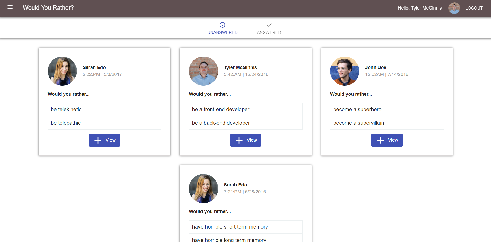

# Would You Rather?



## Project Overview

I built a web app that lets a user play the “Would You Rather?” game. The game goes like this: A user is asked a question in the form: “Would you rather [option A] or [option B] ?”. Answering "neither" or "both" is against the rules.

In the app, users are able to answer questions, see which questions they haven’t answered, see how other people have voted, post questions, and see the ranking of users on the leaderboard.

## Installing

To run the project in **development mode** in your local machine:

* Download or clone the repository in your computer:
```
$ git clone https://github.com/dimikara/React-Neighborhood-Map-3.git
```

* Navigate to the repository directory in your terminal

* Run the following code to install the development dependencies:
```
npm install
```
 or

 ```
 yarn install
 ```

* start the development server with
```
npm start
```
or

```
yarn start
```
* open [http://localhost:3000](http://localhost:3000) to view the site in the browser.

To run the project in the **production mode**:
* Run:
```
npm run build
```
or

```
yarn build
```
This builds the app for production to the `build` folder.<br>
It correctly bundles React in production mode and optimizes the build for the best performance.
See the section about [deployment](https://facebook.github.io/create-react-app/docs/deployment) for more information.

## Important

This project uses a fake backend, so the state will not persist across refreshes.

## Tools & dependencies

* This project was bootstrapped with [Create React App](https://github.com/facebook/create-react-app).
* [Redux](https://github.com/reduxjs/redux)
* [React Redux](https://github.com/reduxjs/react-redux)
* [Redux Thunk](https://github.com/reduxjs/redux-thunk)
* [React Icons](https://react-icons.netlify.com/#/)
* [Material-UI](https://material-ui.com/)
* [React SVG Meters](https://www.npmjs.com/package/react-svg-meters)
